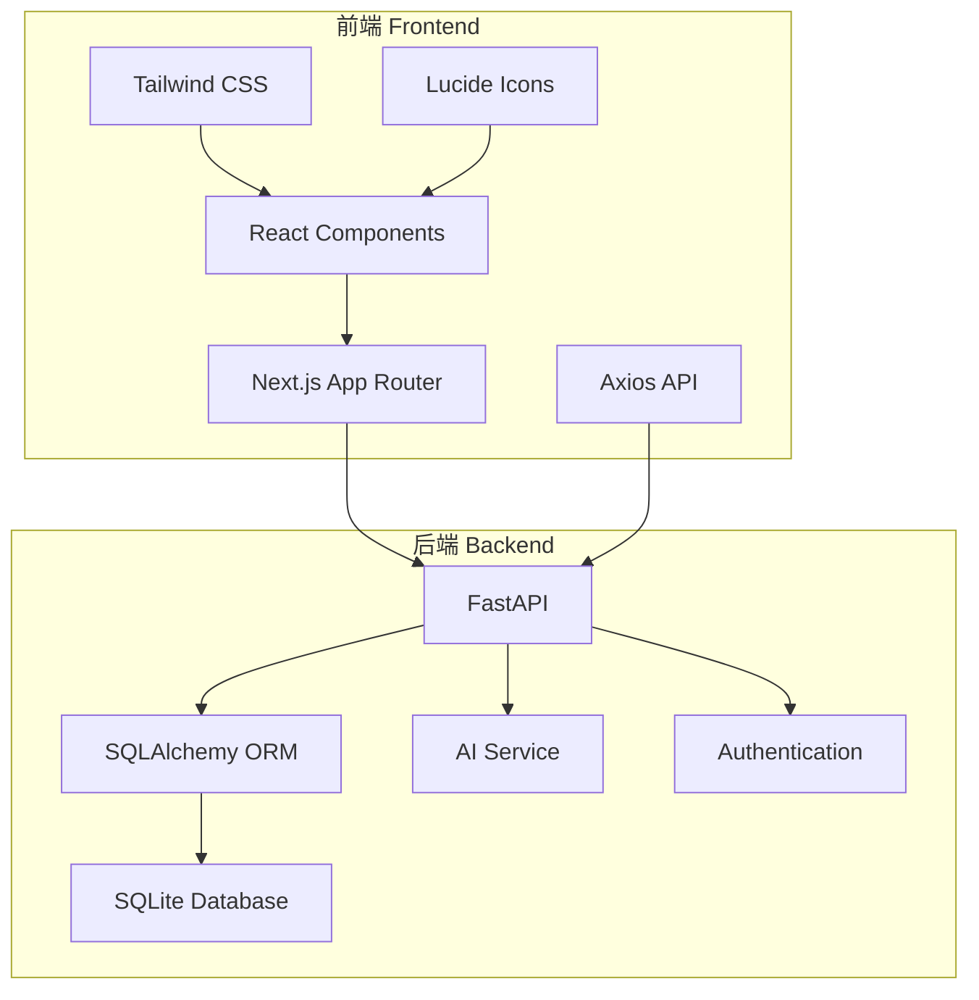
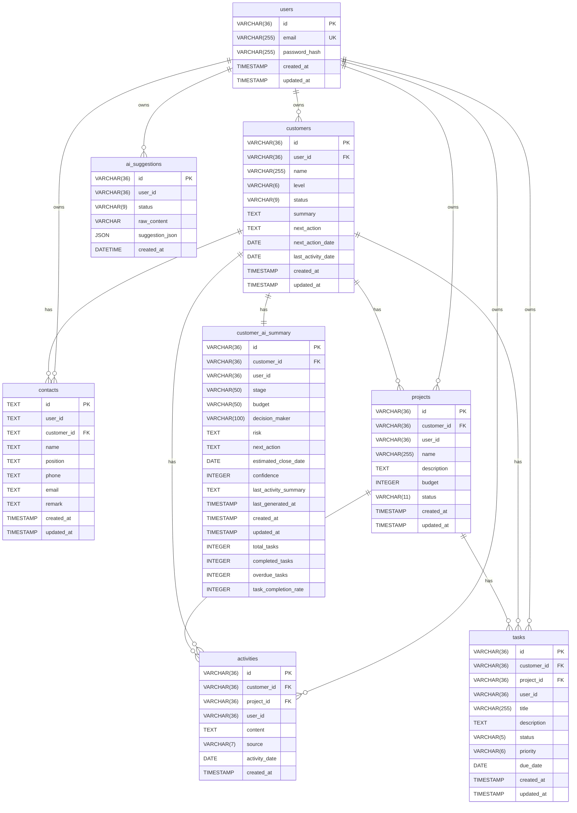
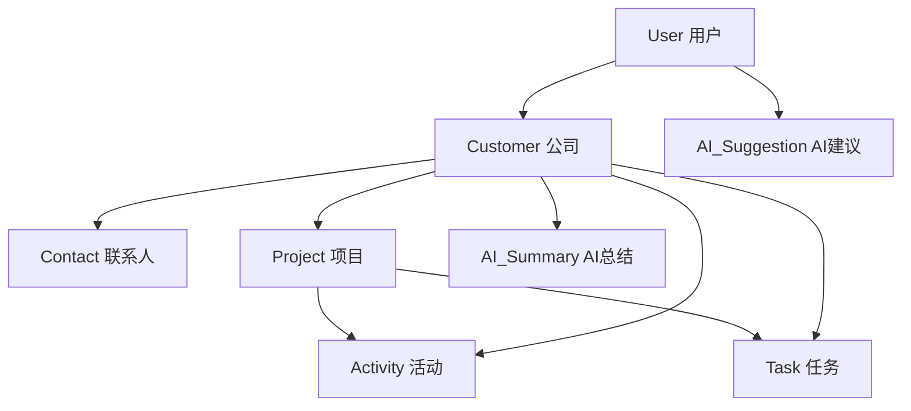

# Sales OS 系统架构文档

## 一、系统架构图

## 二、数据库 ER 图

## 三、数据模型层级

## 四、各模块职责

### 4.1 前端模块

| 模块 | 路径 | 职责 |
|------|------|------|
| 首页 | `/src/app/page.tsx` | 工作台、AI助手、任务中心、重点客户 |
| 客户管理 | `/src/app/customers/page.tsx` | 客户列表、新建客户、客户筛选 |
| 客户详情 | `/src/app/customers/[id]/page.tsx` | 客户详情、时间线、关联任务 |
| 任务中心 | `/src/app/tasks/page.tsx` | 任务列表、任务筛选、任务状态管理 |
| 收件箱 | `/src/app/inbox/page.tsx` | 待处理事项列表 |
| 建议 | `/src/app/suggestions/page.tsx` | AI建议管理 |

### 4.2 后端模块

| 模块 | 路径 | 职责 |
|------|------|------|
| 用户认证 | `/app/api/auth.py` | 登录、认证、权限验证 |
| 客户管理 | `/app/api/customers.py` | 客户CRUD、关联查询 |
| 联系人管理 | `/app/models/contact.py` | 联系人数据模型 |
| 项目管理 | `/app/api/projects.py` | 项目CRUD |
| 任务管理 | `/app/api/tasks.py` | 任务CRUD、状态流转 |
| 活动记录 | `/app/api/activities.py` | 活动CRUD、时间线 |
| AI服务 | `/app/services/ai_service.py` | AI分析、内容生成 |
| AI建议 | `/app/api/suggestions.py` | 建议分析、确认流程 |
| 数据库 | `/app/database.py` | SQLite连接、Session管理 |

### 4.3 枚举定义

| 枚举名 | 值 | 说明 |
|--------|-----|------|
| CustomerLevel | HIGH, MEDIUM, LOW | 客户价值等级 |
| CustomerStatus | ACTIVE, FOLLOWING, PAUSED, LOST | 客户状态 |
| ProjectStatus | LEAD, QUALIFIED, PROPOSAL, NEGOTIATION, WON, LOST | 项目阶段 |
| TaskStatus | TODO, DOING, DONE | 任务状态 |
| TaskPriority | HIGH, MEDIUM, LOW | 任务优先级 |
| ActivitySource | capture, manual, email, meeting | 活动来源 |
| SuggestionStatus | PENDING, CONFIRMED, CANCELLED | 建议状态 |

## 五、数据库一致性检查报告

### 5.1 代码模型 vs 数据库结构

| 表名 | 状态 | 问题 |
|------|------|------|
| customers | ✅ 一致 | 无 |
| contacts | ✅ 一致 | 无 |
| projects | ✅ 一致 | 无 |
| tasks | ✅ 一致 | 无 |
| activities | ✅ 一致 | 无 |
| ai_suggestions | ✅ 一致 | 无 |
| customer_ai_summary | ✅ 一致 | 无 |
| users | ✅ 一致 | 无 |

### 5.2 枚举值一致性

| 枚举字段 | 数据库值 | 模型定义 | 状态 |
|----------|----------|----------|------|
| customers.level | HIGH, MEDIUM | HIGH, MEDIUM, LOW | ✅ 一致 |
| customers.status | ACTIVE, FOLLOWING | ACTIVE, FOLLOWING, PAUSED, LOST | ✅ 一致 |
| tasks.status | TODO | TODO, DOING, DONE | ✅ 一致 |
| tasks.priority | HIGH, MEDIUM | HIGH, MEDIUM, LOW | ✅ 一致 |
| activities.source | manual, capture | capture, manual, email, meeting | ✅ 一致 |
| projects.status | LEAD, NEGOTIATION, QUALIFIED | LEAD, QUALIFIED, PROPOSAL, NEGOTIATION, WON, LOST | ✅ 一致 |

### 5.3 外键关系

| 外键 | 父表 | 状态 |
|------|------|------|
| contacts.customer_id | customers | ✅ 有效 |
| projects.customer_id | customers | ✅ 有效 |
| tasks.customer_id | customers | ✅ 有效 |
| tasks.project_id | projects | ✅ 有效 |
| activities.customer_id | customers | ✅ 有效 |
| activities.project_id | projects | ✅ 有效 |
| customer_ai_summary.customer_id | customers | ✅ 有效 |

### 5.4 历史数据兼容性

| 问题 | 状态 | 说明 |
|------|------|------|
| Activity Source MANUAL→manual | ✅ 已修复 | 数据已迁移 |
| Task Status PENDING→TODO | ✅ 已修复 | 数据已迁移 |
| Project Status .value调用 | ✅ 已修复 | 代码已兼容 |

## 六、技术栈

| 层次 | 技术 | 版本 |
|------|------|------|
| 前端框架 | Next.js | 14.2.35 |
| UI框架 | React | 18+ |
| 样式 | Tailwind CSS | 3+ |
| 图标 | Lucide React | - |
| HTTP客户端 | Axios | - |
| 后端框架 | FastAPI | 0.115+ |
| ORM | SQLAlchemy | 2+ |
| 数据库 | SQLite | 3+ |
| AI服务 | DeepSeek API | - |