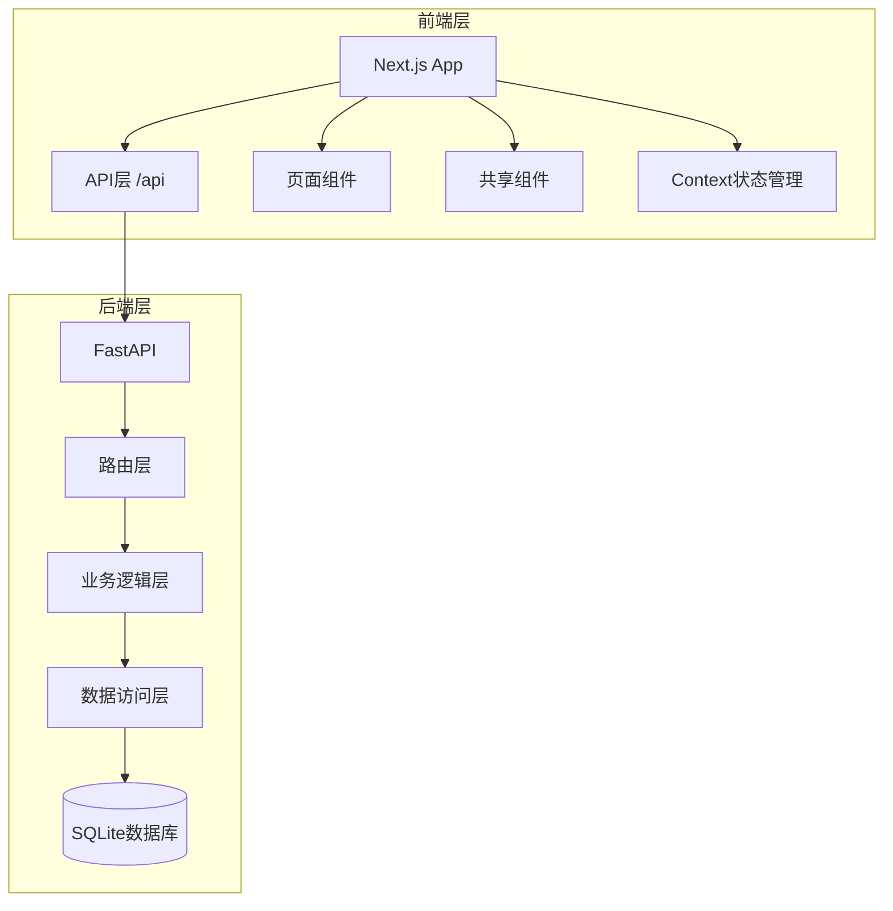
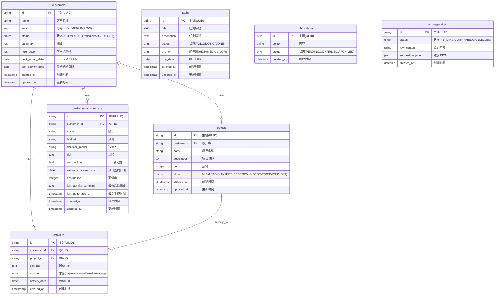

# Sales OS 架构文档

## 1. 系统概览

Sales OS 是一个现代化的销售操作系统，采用前后端分离架构。

### 技术栈

| 层级 | 技术 | 版本 |
|------|------|------|
| 前端框架 | Next.js | 14.2.15 |
| 前端语言 | TypeScript | 5.6.0 |
| 前端样式 | Tailwind CSS | 3.4.14 |
| 状态管理 | React Context | - |
| 后端框架 | FastAPI | 0.115.0 |
| 后端语言 | Python | 3.10+ |
| 数据库 | SQLite | - |
| ORM | SQLAlchemy | 2.0.35 |
| 数据验证 | Pydantic | 2.9.0 |

## 2. 架构图



## 3. 数据库 ER 图



## 4. 前端路由结构

```mermaid
graph LR
    A[/] --> B[工作台]
    A --> C[/customers]
    C --> D[/customers/[id]]
    A --> E[/tasks]
    A --> F[/inbox]
    F --> G[/inbox/[id]]
    A --> H[/suggestions]
    H --> I[/suggestions/[id]]
    A --> J[/knowledge]
    A --> K[/settings]
```

### 路由详情

| 路径 | 页面 | 功能 |
|------|------|------|
| `/` | DashboardPage | 工作台首页，AI分析入口 |
| `/customers` | CustomersPage | 客户列表页 |
| `/customers/[id]` | CustomerDetailPage | 客户详情页 |
| `/tasks` | TasksPage | 任务管理页 |
| `/inbox` | InboxPage | 收件箱页 |
| `/inbox/[id]` | InboxDetailPage | 收件箱详情页 |
| `/suggestions` | SuggestionsPage | AI建议列表页 |
| `/suggestions/[id]` | SuggestionDetailPage | AI建议详情页 |
| `/knowledge` | KnowledgePage | 知识库页 |
| `/settings` | SettingsPage | 系统设置页 |

## 5. 前后端依赖关系

### 前端 API 调用映射

| 前端页面 | 调用的 API | 方法 |
|----------|-----------|------|
| `/` | `/api/activities` | GET |
| `/` | `/api/tasks` | GET |
| `/` | `/api/customers` | GET |
| `/` | `/api/suggestions/analyze` | POST |
| `/` | `/api/suggestions/{id}/confirm` | POST |
| `/customers` | `/api/customers` | GET |
| `/customers/[id]` | `/api/customers/{id}` | GET |
| `/customers/[id]` | `/api/customers/{id}/ai-summary` | GET |
| `/customers/[id]` | `/api/activities/customer/{id}` | GET |
| `/customers/[id]` | `/api/projects/customer/{id}` | GET |
| `/tasks` | `/api/tasks` | GET |
| `/tasks` | `/api/tasks/{id}` | PATCH |
| `/inbox` | `/api/inbox` | GET |
| `/inbox/[id]` | `/api/inbox/{id}` | PATCH |
| `/suggestions` | `/api/suggestions/analyze` | POST |

### 代理配置

前端通过 `next.config.mjs` 配置 API 代理：

```js
async rewrites() {
  return [
    {
      source: '/api/:path*',
      destination: 'http://localhost:8000/api/:path*'
    }
  ]
}
```

## 6. 项目结构

### 前端结构

```
frontend/
├── src/
│   ├── app/                 # 路由页面
│   │   ├── customers/       # 客户模块
│   │   ├── inbox/           # 收件箱模块
│   │   ├── knowledge/       # 知识库模块
│   │   ├── settings/        # 设置模块
│   │   ├── suggestions/     # AI建议模块
│   │   ├── tasks/           # 任务模块
│   │   ├── layout.tsx       # 根布局
│   │   └── page.tsx         # 首页
│   ├── components/          # 共享组件
│   ├── context/             # React Context
│   ├── hooks/               # 自定义Hooks
│   ├── lib/                 # 工具函数
│   ├── styles/              # 全局样式
│   └── types/               # TypeScript类型定义
├── next.config.mjs          # Next.js配置
├── tailwind.config.js       # Tailwind配置
├── postcss.config.mjs       # PostCSS配置
└── package.json             # 依赖配置
```

### 后端结构

```
backend/
├── app/
│   ├── api/                 # API路由
│   │   ├── activities.py
│   │   ├── customers.py
│   │   ├── customer_ai_summary.py
│   │   ├── health.py
│   │   ├── inbox.py
│   │   ├── projects.py
│   │   ├── suggestions.py
│   │   └── tasks.py
│   ├── config/              # 配置文件
│   ├── models/              # 数据库模型
│   ├── schemas/             # Pydantic模式
│   ├── utils/               # 工具函数
│   ├── database.py          # 数据库连接
│   └── main.py              # 应用入口
├── data/                    # SQLite数据文件
└── requirements.txt         # Python依赖
```
